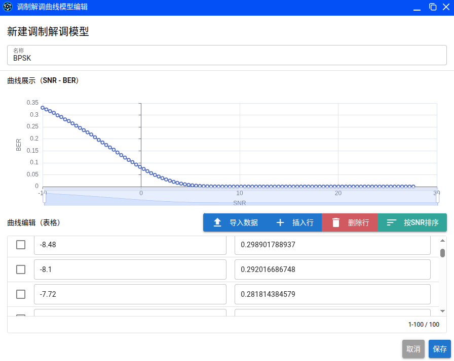

# Changelog

# 更新日志

## [v20260109+miaosuan-0.2.8] - 2026-01-09 - 调制解调模型与平台优化

嗨各位，元旦过完，新的一年，妙算平台又为大家带来了新的功能和优化！调制解调模型的支持可以帮助大家更轻松地进行无线通信仿真建模。另外我们十分重视你的创造性工作，这次优化了登录态失效后的处理逻辑，避免丢失你的工作进度。

### 亮点：
1. **调制解调模型支持**： 蓝图平台新增了调制解调模型支持，可以直接通过调制解调模型编辑器对调制解调曲线进行可视化查看和编辑了。妙算引擎也新增了调制解调模型的新API支持，方便大家直接读取并使用调制解调曲线数据。
</img>

### 新增：
1. **场景视角保存功能**: 现在在保存场景文件时，当前的地图视角也会一并保存，下次打开场景文件时会自动恢复到上次保存时的视角，方便继续编辑。

### 优化：
1. **图标库自动刷新功能**: 从模型市场安装模型后，如果模型包包含图标库，图标库列表会自动刷新，无需手动刷新图标库了。
2. **编辑器窗口打开逻辑**: 优化了编辑器窗口打开逻辑，当打开编辑器窗口时，会自动检查当前模型的编辑器窗口是否已经打开，如果已经打开，则直接聚焦到该窗口，不再重新创建窗口。
3. **登录态失效草稿功能**: 我们十分重视你的创造性工作，优化了登录态失效后的处理逻辑，当登录态失效时，将弹出对话框引导用户在新窗口中重新登录，避免打断当前窗口中的工作流，且会自动保存场景草稿，下次登录时，会提醒恢复草稿。

## [v20251226+miaosuan-0.2.7] - 2025-12-26 - 🛠️ 远程调试功能

感谢大家的支持，本周我们为妙算平台新增了**远程调试功能**，支持使用IDE进行模型代码调试了！

### 亮点：
1.  **远程调试支持**：现在可以在通过命令行启动仿真时，通过 `--debug` 参数开启调试模式，并自动启动本地隧道，方便在 VS Code 等 IDE 中进行远程调试。虽然仿真仍然在云端运行，但你可以通过本地调试器连接到仿真任务中，实现对 Python 代码的断点调试，实现更加顺畅的本地开发体验。详情请参阅[本地开发工具文档](https://github.com/znetlink/miaosuan/blob/master/docs/miaosuan-cli.md)。
2. **本地开发工具升级**: MIAOSUAN-CLI工具升级至0.3.1版本，支持上述远程调试功能，并修复了一些已知问题。[下载地址](https://www.ilanzou.com/s/dFtnWHPh)

### 新增：
1. **模型批量导出功能**：现在可以通过模型库的批量导出功能，一键将Workspace内的多个模型/图标导出为7z压缩包，方便进行共享和备份。导出的压缩包可以直接通过模型库的批量导入功能导入到其他Workspace中。

### 优化：
1. **平台编辑器拖拽优化**：优化了在平台编辑器中，从设备库拖拽设备到平台中时，只能通过拖拽标签实现的问题，现在整个图标都可以进行拖拽操作了。
2. **图标库设置优化**：优化了图标库的管理功能，现在图标库操作更人性化，添加和编辑都可以取消了。

## [v20251219+miaosuan-0.2.7] - 2025-12-19 - 🎨 图形标绘与其他优化

Hi 各位，本周我们如期进行了妙算平台的更新，带来了图形标绘功能和多项优化！

### 亮点：
1.  **图形标绘**：现在可以轻松地绘制各种图形，如圆形、矩形、多边形、文本框等，并显示在地图、平台编辑器、设备编辑器，甚至状态机编辑器中！现在你可以以更直观的方式来描述各种场景、平台、设备，添加你想要的说明信息，便于理解和交流。本地开发工具的VSCode扩展（[下载](https://www.ilanzou.com/s/3hon0K75)）同步更新至v0.2.0，支持图形绘制。

### 新增：
1. **平台复制粘贴**：现在可以轻松复制平台，并快速在场景中粘贴平台，提高场景构建效率。
2. **密码重置功能**：忘记密码？现在可以通过电子邮箱重置密码，并使用新密码登录。

### 优化：
1. **窗口关闭提示**：现在更多的编辑器窗口支持关闭前的保存提醒了，避免误操作导致数据丢失。优化的编辑器包括：设备编辑器、进程编辑器、数据包编辑器、ICI编辑器以及管道阶段编辑器。

### 修复：
1. **本地开发工具**: 修复了本地开发工具的VSCode扩展在保存时产生图形残影的问题。

## [v20251212+miaosuan-0.2.7] - 2025-12-12 - 🛠️ 本地开发支持

本次更新，我们引入了更便捷的本地开发工作流，旨在显著提升模型开发与测试效率。

### 重要提示
1.  **进程模型格式升级**：从本版本起，进程模型文件格式将从 v1 升级至 v2。打开旧版模型文件时，系统会自动提示并引导您完成格式转换。

### 亮点：
1.  **本地开发 CLI 工具**：全新推出 `miaosuan-cli` 命令行工具，支持在本地环境中编写、提交和运行 Python 模型代码。详情请参阅[本地开发工具文档](https://gitcode.com/znetlink/miaosuan/blob/master/docs/miaosuan-cli.md)。
2.  **VS Code 扩展**：新增妙算平台专属的 VS Code 扩展，支持在 VS Code 中直接进行进程模型的可视化编辑。具体使用方法详见上述文档。
3.  **状态机转移增强**：现支持在任意两个状态之间创建多条转移线，便于描述更复杂的业务逻辑。

### 新增：
1.  **状态机转移备注**：可在状态机转移线上添加文字备注，用于记录转移条件或逻辑说明，使模型更易读。
2.  **多选操作**：在场景编辑器中，按住 `Ctrl` 键可同时选择多个平台，方便进行批量移动、删除等操作。
3.  **有线端口配置**：在设备模型编辑器中，新增**有线端口配置**功能，允许为设备添加多个物理端口，并可独立配置其**端口类型**。
4.  **多API Key管理**：现支持创建并管理多个 API Key，方便不同的本地开发工具或脚本安全地访问平台资源。

### 修复：
1.  修复了在场景编辑器的“平台移动”模式下，偶尔无法拖动平台的问题。
2.  修复了新建场景文件时，未清空当前场景元数据（如场景名称），可能导致意外覆盖已有场景的问题。

## [v20251207+miaosaun-0.2.4] - 2025-12-07 - 🛠️ 管道阶段编辑器与全局快捷键
本次更新，我们为妙算注入了更精细化的**管道（Pipeline）阶段建模能力**和更流畅的交互体验。

### 亮点：
1.  **全新管道阶段编辑器**：现已支持对通信管道各阶段进行独立的可视化编辑与管理。全新的模型架构已被应用于最新的 **Generic_Wireless** 模型v0.2.0版本。
2.  **快捷键支持**：使用 `Ctrl + 1/2/3` 可快速切换地图视图模式，并在各编辑器中均支持 `Ctrl + S` 进行快速保存。
3.  **仿真参数持久化**：仿真参数现将自动随场景文件保存与加载，无需重复设置。

### 优化：
1.  **地图平台标签**：平台名称默认显示于图标下方，并新增显示位置与偏移量的自定义配置项。
2.  **界面精简**：移除了选中平台时地图右上角的冗余信息面板，使界面更加清爽。
3.  **平台编辑器增强**：新增显式的“添加有线连接”按钮，便于在节点移动与连线模式间切换。默认保持为节点移动模式。
4.  **窗口交互优化**：优化了各窗口的焦点切换逻辑与视觉反馈效果。

### 修复：
1.  **修复了平台编辑器在进行连线操作时可能引起界面卡顿的问题。**

我们努力提升用户体验，并持续调整，让您的仿真工作流更加高效与清晰。

—— 智网妙算 · 持续演进中

## [v20251203+miaosuan-0.2.1] - 2025-12-03 - 🤖 妙算首次更新
妙算平台迎来了内测以后的首次更新，我们为你带来了新的功能。

本次更新:

### 亮点:
1. 新增**卫星平台**功能！可以通过模型库上传TLE格式的卫星轨道数据，将卫星轨道设置到任意平台上，可以支持可视化显示卫星轨道。
</img>
</img>

2. 妙算也同步更新支持卫星平台的移动。

3. 轨迹运动和卫星轨道合并成为了运动管理菜单，现在都能够进行可视化了。

### 新增：
1. 增加了底部的状态栏，现在你可以清楚地看到当前打开的仿真场景，以及保存状态了。
2. 增加了地图底部的状态栏，现在能够看到鼠标所在位置的经纬度等信息了。

### 优化：
1. 平台模型编辑器现在也能看到当前的模型名称和保存状态了。

## [v20251128+miaosuan-0.1.26] - 2025-11-28 - 🚀 智网妙算上线啦！

今天智网妙算-云端网络仿真平台正式开始内测了！
