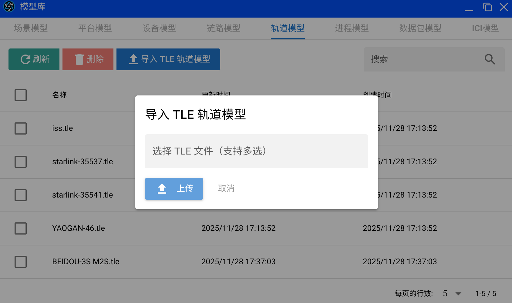

# Changelog

# 更新日志

## [v20251212+miaosuan-0.2.7] - 2025-12-12 - 🛠️ 本地开发支持

本次更新，我们引入了更便捷的本地开发工作流，旨在显著提升模型开发与测试效率。

### 重要提示
1.  **进程模型格式升级**：从本版本起，进程模型文件格式将从 v1 升级至 v2。打开旧版模型文件时，系统会自动提示并引导您完成格式转换。

### 亮点：
1.  **本地开发 CLI 工具**：全新推出 `miaosuan-cli` 命令行工具，支持在本地环境中编写、提交和运行 Python 模型代码。详情请参阅[本地开发工具文档](https://gitcode.com/znetlink/miaosuan/blob/master/docs/miaosuan-cli.md)。
2.  **VS Code 扩展**：新增妙算平台专属的 VS Code 扩展，支持在 VS Code 中直接进行进程模型的可视化编辑。具体使用方法详见上述文档。
3.  **状态机转移增强**：现支持在任意两个状态之间创建多条转移线，便于描述更复杂的业务逻辑。

### 新增：
1.  **状态机转移备注**：可在状态机转移线上添加文字备注，用于记录转移条件或逻辑说明，使模型更易读。
2.  **多选操作**：在场景编辑器中，按住 `Ctrl` 键可同时选择多个平台，方便进行批量移动、删除等操作。
3.  **有线端口配置**：在设备模型编辑器中，新增**有线端口配置**功能，允许为设备添加多个物理端口，并可独立配置其**端口类型**。
4.  **多API Key管理**：现支持创建并管理多个 API Key，方便不同的本地开发工具或脚本安全地访问平台资源。

### 修复：
1.  修复了在场景编辑器的“平台移动”模式下，偶尔无法拖动平台的问题。
2.  修复了新建场景文件时，未清空当前场景元数据（如场景名称），可能导致意外覆盖已有场景的问题。

## [v20251207+miaosaun-0.2.4] - 2025-12-07 - 🛠️ 管道阶段编辑器与全局快捷键
本次更新，我们为妙算注入了更精细化的**管道（Pipeline）阶段建模能力**和更流畅的交互体验。

### 亮点：
1.  **全新管道阶段编辑器**：现已支持对通信管道各阶段进行独立的可视化编辑与管理。全新的模型架构已被应用于最新的 **Generic_Wireless** 模型v0.2.0版本。
2.  **快捷键支持**：使用 `Ctrl + 1/2/3` 可快速切换地图视图模式，并在各编辑器中均支持 `Ctrl + S` 进行快速保存。
3.  **仿真参数持久化**：仿真参数现将自动随场景文件保存与加载，无需重复设置。

### 优化：
1.  **地图平台标签**：平台名称默认显示于图标下方，并新增显示位置与偏移量的自定义配置项。
2.  **界面精简**：移除了选中平台时地图右上角的冗余信息面板，使界面更加清爽。
3.  **平台编辑器增强**：新增显式的“添加有线连接”按钮，便于在节点移动与连线模式间切换。默认保持为节点移动模式。
4.  **窗口交互优化**：优化了各窗口的焦点切换逻辑与视觉反馈效果。

### 修复：
1.  **修复了平台编辑器在进行连线操作时可能引起界面卡顿的问题。**

我们努力提升用户体验，并持续调整，让您的仿真工作流更加高效与清晰。

—— 智网妙算 · 持续演进中

## [v20251203+miaosuan-0.2.1] - 2025-12-03 - 🤖 妙算首次更新
妙算平台迎来了内测以后的首次更新，我们为你带来了新的功能。

本次更新:

### 亮点:
1. 新增**卫星平台**功能！可以通过模型库上传TLE格式的卫星轨道数据，将卫星轨道设置到任意平台上，可以支持可视化显示卫星轨道。
</img>
</img>

2. 妙算也同步更新支持卫星平台的移动。

3. 轨迹运动和卫星轨道合并成为了运动管理菜单，现在都能够进行可视化了。

### 新增：
1. 增加了底部的状态栏，现在你可以清楚地看到当前打开的仿真场景，以及保存状态了。
2. 增加了地图底部的状态栏，现在能够看到鼠标所在位置的经纬度等信息了。

### 优化：
1. 平台模型编辑器现在也能看到当前的模型名称和保存状态了。

## [v20251128+miaosuan-0.1.26] - 2025-11-28 - 🚀 智网妙算上线啦！

今天智网妙算-云端网络仿真平台正式开始内测了！
